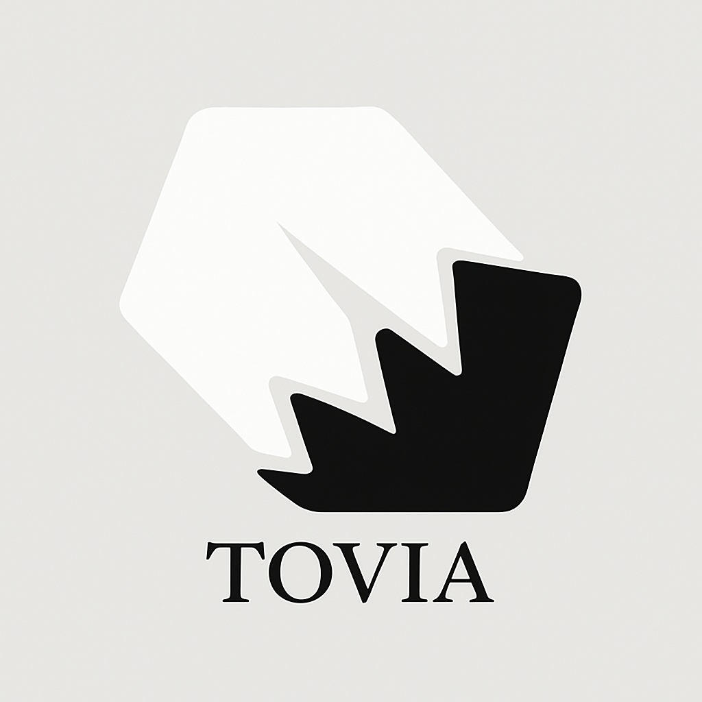

# Assets

이미지 관련 자료.

## 아이콘

아래는 디자이너 김승균님이 제작한 아이콘입니다.

|아이콘|설명|
|--|--|
|| ●형태구조 형태 부분에선 사람이든 동물이든 "정확한 정답의 형태는 없다" 라고 생각해서 일반 정형적인 도형이아닌 결정의 형태를 생각하면서 작업을 해봤습니다. 하지만 아예 비 정형적인 형태는 디자인적으로 보기 좋지않아 어느정도 형태는 잡아뒀습니다. ●크랙구조  하단의 크랙이 일어난부분은 구조적으로 파손, 결손 이 된것을 표현한것이며 손상이 일어나 치료 및 보완이 필요한 부분이라는것을 시각적으로 보여주는 부분입니다. ○온전하게 완벽한 형태로 때워지지 않은부분은 "어떤형태로든 손상을 입으면 완벽하게 복구는 불가능하다. 하지만 완벽한 치유는 불가능하지만 도움이 될수있다." 라고 생각해서 중간에 완전히 때워지지않은 깊은 크랙을 하나 추가하여 작업을 했습니다.|
||●형태구조 형태 부분에선 사람이든 동물이든 "정확한 정답의 형태는 없다" 라고 생각해서 일반 정형적인 도형이아닌 결정의 형태를 생각하면서 작업을 해봤습니다. 하지만 아예 비 정형적인 형태는 디자인적으로 보기 좋지않아 어느정도 형태는 잡아뒀습니다. ●크랙구조 하단의 크랙이 일어난부분은 구조적으로 파손, 결손 이 된것을 표현한것이며 손상이 일어나 치료 및 보완이 필요한 부분이라는것을 시각적으로 보여주는 부분입니다. ○온전하게 완벽한 형태로 때워지지 않은부분은 "어떤형태로든 손상을 입으면 완벽하게 복구는 불가능하다. 하지만 완벽한 치유는 불가능하지만 도움이 될수있다." 라고 생각해서 중간에 완전히 때워지지않은 깊은 크랙을 하나 추가하여 작업을 했습니다.|
||1. 로고의 형태 우선 시작하는 라인업이 유기견같은 동물에 관련된 내용으로 알고있어서 대표적인 애완동물인 개 의 발자국을 기초 틀로삼음 2. 크랙 기본 로고의 아이덴티티는 저 깨져서 떨어져나간 크랙으로 잡고 작업을 진행. 크랙의 의미는 기존 로고와 같이 "손상되었고 온전히 복구할수없지만 도움은 줄수있는상태" 그대로 반영. 3.파편의 배치 깨지고 망가졌지만 파편들은 일부 온전한 형태로 배치됨. 즉 기존형태를 알수있기에 복구, 복원이 가능함.|