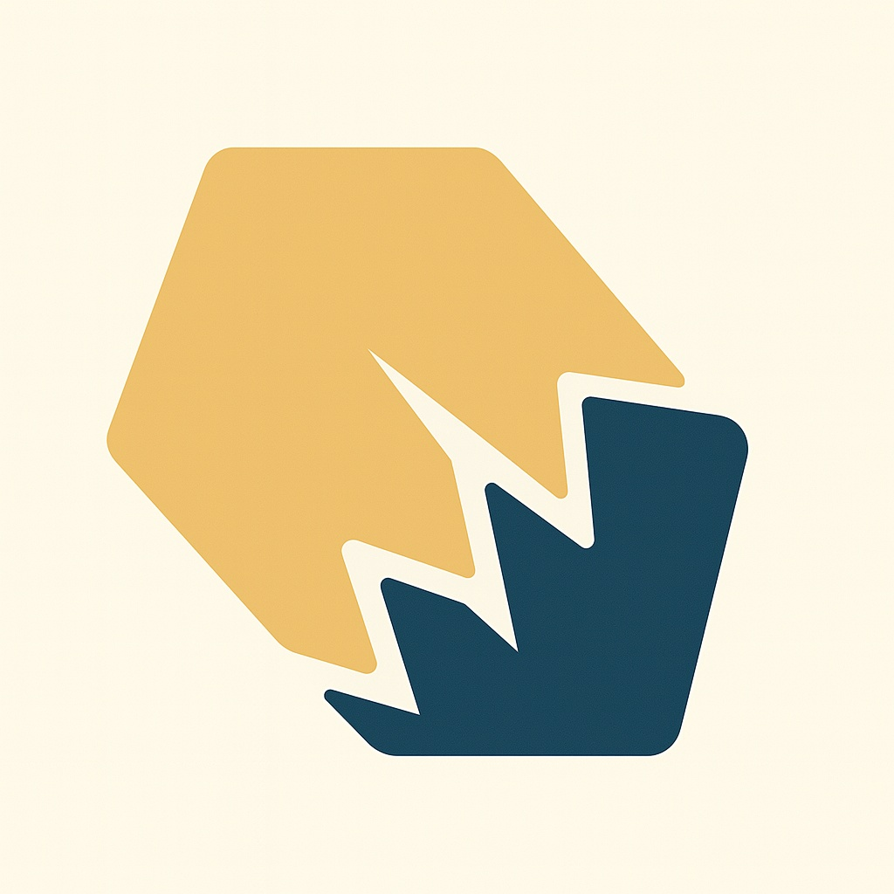
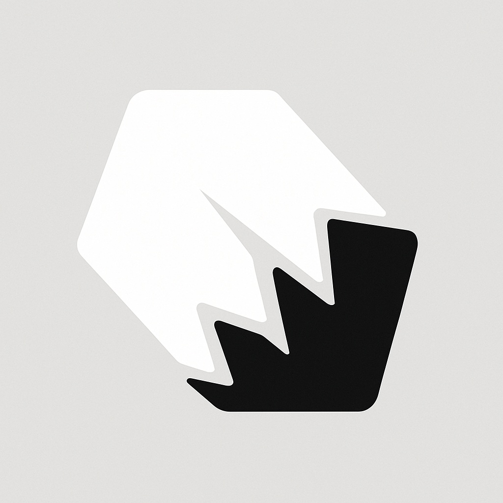

# Assets

이미지 관련 자료.

## 아이콘

아래는 디자이너 김상균님이 제작한 아이콘입니다.

|아이콘|설명|
|--|--|
||●형태구조
형태 부분에선 사람이든 동물이든 "정확한 정답의 형태는 없다" 라고 생각해서 일반 정형적인 도형이아닌 결정의 형태를 생각하면서 작업을 해봤습니다. 하지만 아예 비 정형적인 형태는 디자인적으로 보기 좋지않아 어느정도 형태는 잡아뒀습니다.

●크랙구조
하단의 크랙이 일어난부분은 구조적으로 파손, 결손 이 된것을 표현한것이며 손상이 일어나 치료 및 보완이 필요한 부분이라는것을 시각적으로 보여주는 부분입니다.

○온전하게 완벽한 형태로 때워지지 않은부분은 "어떤형태로든 손상을 입으면 완벽하게 복구는 불가능하다. 하지만 완벽한 치유는 불가능하지만 도움이 될수있다." 라고 생각해서 중간에 완전히 때워지지않은 깊은 크랙을 하나 추가하여 작업을 했습니다.|
||●형태구조
형태 부분에선 사람이든 동물이든 "정확한 정답의 형태는 없다" 라고 생각해서 일반 정형적인 도형이아닌 결정의 형태를 생각하면서 작업을 해봤습니다. 하지만 아예 비 정형적인 형태는 디자인적으로 보기 좋지않아 어느정도 형태는 잡아뒀습니다.

●크랙구조
하단의 크랙이 일어난부분은 구조적으로 파손, 결손 이 된것을 표현한것이며 손상이 일어나 치료 및 보완이 필요한 부분이라는것을 시각적으로 보여주는 부분입니다.

○온전하게 완벽한 형태로 때워지지 않은부분은 "어떤형태로든 손상을 입으면 완벽하게 복구는 불가능하다. 하지만 완벽한 치유는 불가능하지만 도움이 될수있다." 라고 생각해서 중간에 완전히 때워지지않은 깊은 크랙을 하나 추가하여 작업을 했습니다.|